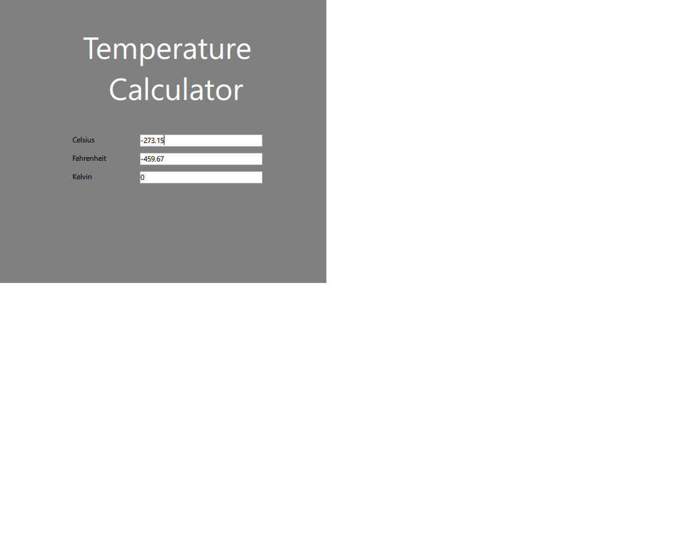

# 🌡️ Temperature Calculator (MVC, Qt/C++)

A desktop application for converting temperatures between Celsius and Fahrenheit using the Model–View–Controller (MVC) pattern. Built with C++ and the Qt framework for cross-platform GUI.

## 🚀 Features

- Temperature conversion: Celsius ↔ Fahrenheit
- GUI built with Qt Widgets
- Clear MVC architecture
- Easy to extend (e.g., add Kelvin, localization)

## 📁 Project Structure

CalculatorOfTemperaturesMVC/
├── model/
│ └── temperatureconverter.cpp/h
├── view/
│ └── mainwindow.ui/.cpp/.h
├── controller/
│ └── temperaturecontroller.cpp/h
└── main.cpp

## 🖥 Interface Preview

## ⚙️ How to Run

1. Clone the repository:
git clone https://github.com/CeH99/CalculatorOfTemperaturesMVC.git
cd CalculatorOfTemperaturesMVC

2. Open in Qt Creator or build with `qmake`:
qmake
make
./CalculatorOfTemperaturesMVC

## 🧱 How to Extend

- Add Kelvin conversion in `temperatureconverter.cpp`
- Support more UI themes via Qt Styles
- Add multilingual UI via Qt's translation system

## ✅ TODO Ideas

- Unit tests with QTest
- Improve input validation and edge case handling
- Package for Windows/macOS/Linux
- 
*Developed by CeH99*
